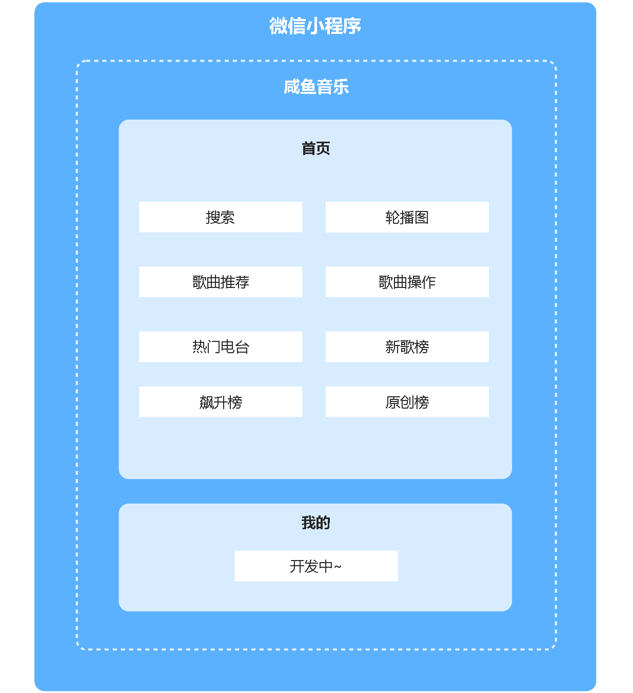
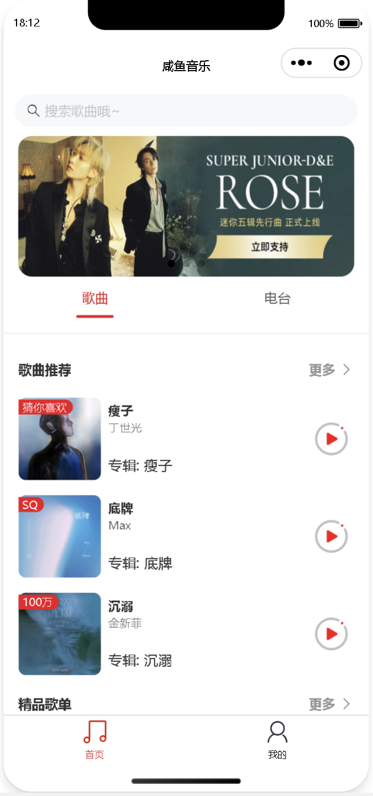
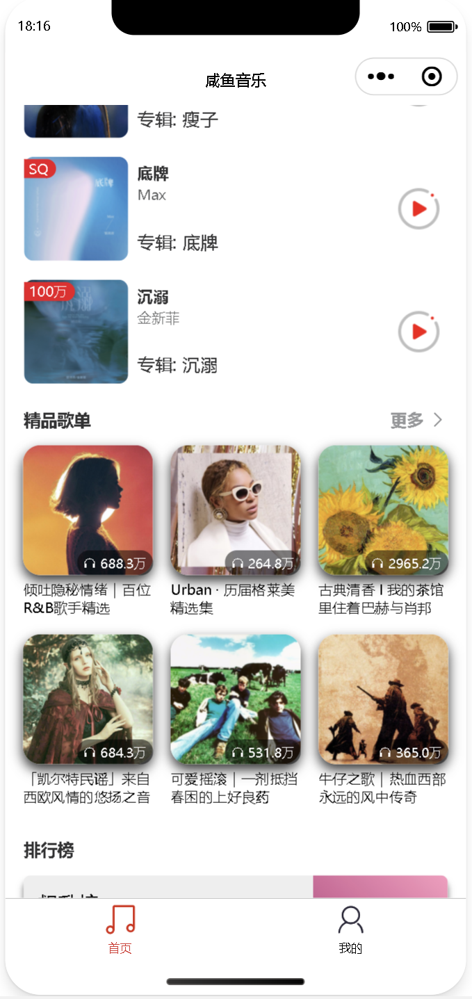
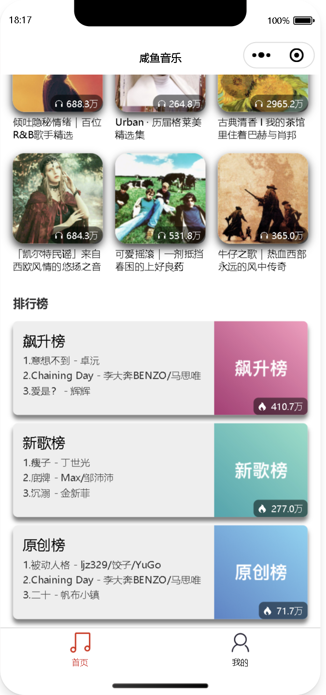
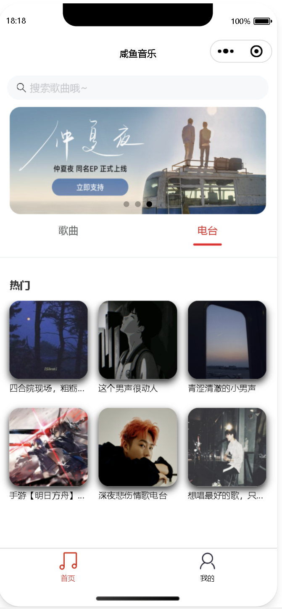
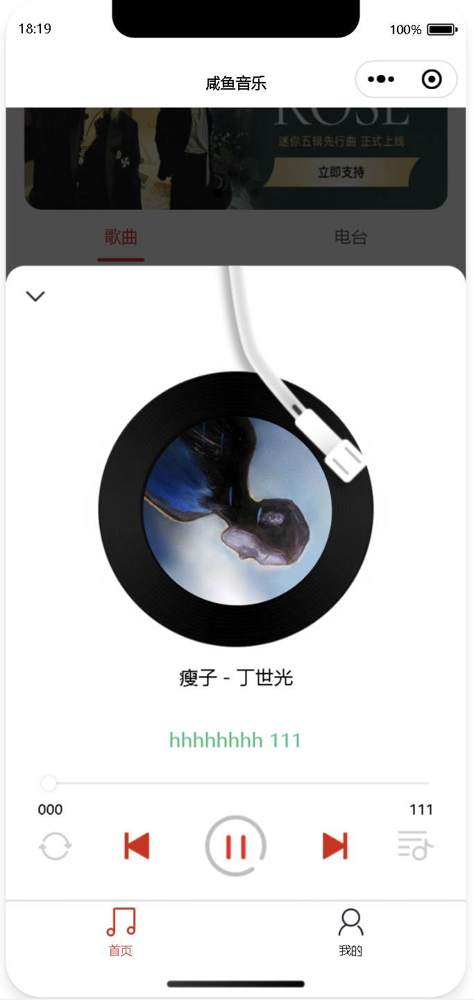

    

<h1 align="center">FreeFish-Music</h1>

<strong>一个极简的音乐微信小程序</strong>

<strong>欢迎 star ~ 后续更新</strong>

## 项目介绍

用户可在线播放音乐，播放具体的歌曲、专辑或歌手的音乐。根据用户的听歌历史和偏好，推荐相关的音乐内容，帮助用户发现新的音乐作品。提供各种音乐排行榜，包括热门歌曲、热门专辑或热门歌手，用户可以浏览并选择感兴趣的音乐进行播放。

## 功能结构

## 页面展示

> 机型：iPhone 12/13 (Pro)

### 主页

### 电台

### 播放

## 写在后面的未完善点

1. 其他机型未适配
2. 未接入后端服务
3. 歌词功能未展示
4. ......
